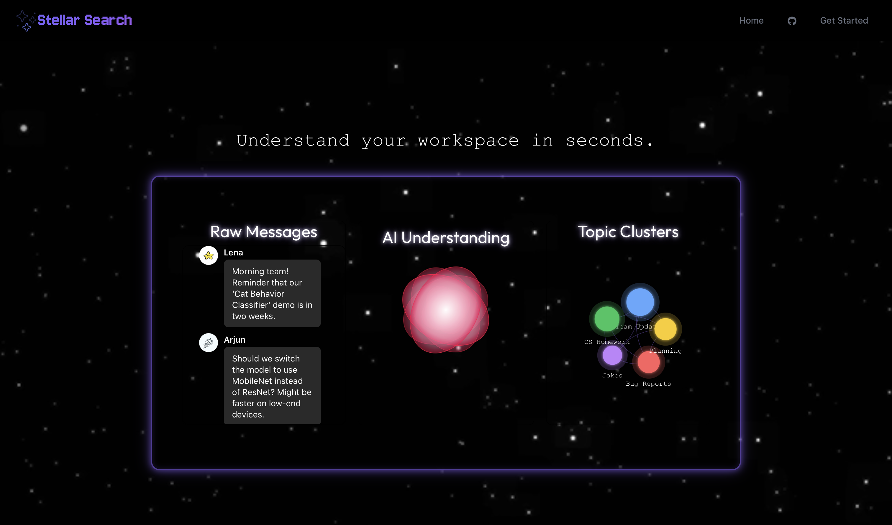

# Stellar Search DS Project
## About
**Can't find the message you're looking for on Slack?**

Slack is a widely used application, but its search and message filtering are very limited. Because it’s keyword-based, it often misses context, making it frustrating for users to find what they’re looking for.

**Stellar Search** fixes this problem by delivering insights from your chat logs through context clustering.





### Key Features:
1. **Slack Integration** - Automated Slack bot retrieves messages directly from Slack channels for analysis
2. **Contextual Search Beyond Keywords** - Uses semantic embeddings to understand message meaning and context, not just keyword matching
3. **Automatic Topic Labeling** - AI-generated labels and tags for each cluster using open-source LLMs, making it easier to understand conversation themes at a glance
4. **Interactive Dashboards** - Visual cluster graphs and analytics to explore conversation patterns across your Slack channels

### Workflow Diagram


### Built With
[![React][React]][React-url]
[![Python][Python]][Python-url]
[![NPM][NPM]][NPM-url]
[![Supabase][Supabase]][Supabase-url]

## Getting Started

Before running the frontend locally, make sure you have the following installed:

- **Node.js** (v18 or higher)
- **npm** (v9 or higher) or **yarn**
- **Git**

To check your versions:
```bash
node -v
npm -v
```

Once you clone the repository:
```bash
cd frontend 
npm run dev
```

## Team Members:

* **Eric Azayev** \- User Stories/Slack App Developer
* **Jessica Chen** \- Backend Developer   
* **Faizan Khan** \- Slackbot Developer
* **Destiny Rosado Salcedo** \- Frontend Developer 
* **Oleksii Sudarin** \- Cluster Graph Developer

[React]: https://img.shields.io/badge/react-%2320232a.svg?style=for-the-badge&logo=react&logoColor=%2361DAFB
[React-url]: https://react.dev/

[NPM]: https://img.shields.io/badge/NPM-%23CB3837.svg?style=for-the-badge&logo=npm&logoColor=white
[NPM-url]: https://www.npmjs.com/

[Python]: https://img.shields.io/badge/python-FFDE57?style=for-the-badge&logo=python&logoColor=4584B6
[Python-url]: https://www.python.org/

[Supabase]: https://img.shields.io/badge/Supabase-3FCF8E?logo=supabase&logoColor=fff
[Supabase-url]: https://supabase.com/
